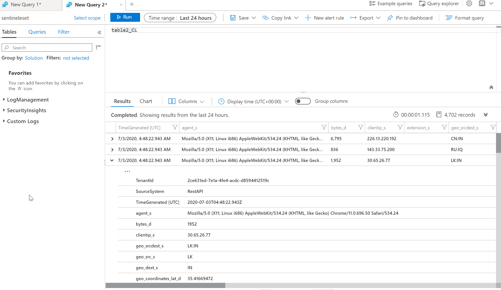

# Elastic to Sentinel connector
You might want to use Azure Sentinel for all your cloud-based events such as Azure, Office365, Defender ATP, AAD and others, but existing on-premises systems aggregate logs in Elastic. This connector can be used to selectively move data from Elastic to Azure Monitor Log Analytics workspace (and therefore Sentinel) allowing you to filter the most interesting security data from your Elastic instance and feed it to Sentinel for global view and correlation.

## How it works
Python scripts access Azure Blob storage container looking for files with queries (name of the file will be used as custom table name in Sentinel). This allows person with no knowledge of this code add or modify Elastic queries. Script than downloads data from Elastic and push it to Sentinel.

TODO:
- Add checks for limits (query sizes etc.)
- Dockerfile
- Elastic authentication
- Add offset from current time (to allow for some eventual consistency on Elastic side)

Before running script make sure environmental variables are set as in [.vars.example](.vars.example) file.

Queries are stored in Azure Blob container using tablename.query convention where tablename is name of custom table in Azure Monitor Log Analytics that will get created. Query must include timestamp range with <START_TIME> and <END_TIME> placeholders (see examples in [table1.query](table1.query)).

## Example
Create Elastic instance using Azure Container Instances and make sure you modify elk.yaml to set your own unique DNS name.

```bash
az group create -n elk -l westeurope
az container create -g elk -f elk.yaml
```

Connect to Kibana and use GUI to generate sample data from Web Server.

Create storage account, containers and upload two example queries/tables.
```bash
az storage account create -n mujelastiktosentinel123 -g elk
export AZURE_STORAGE_CONNECTION_STRING=$(az storage account show-connection-string -n mujelastiktosentinel123 -g elk --query connectionString -o tsv)
az storage container create --connection-string $AZURE_STORAGE_CONNECTION_STRING -n queries 
az storage container create --connection-string $AZURE_STORAGE_CONNECTION_STRING -n checkpoints 
az storage blob upload -f ./table1.query --name table1.query -c queries --connection-string $AZURE_STORAGE_CONNECTION_STRING
az storage blob upload -f ./table2.query --name table2.query -c queries --connection-string $AZURE_STORAGE_CONNECTION_STRING
```

Run script and check tables are created in Azure Monitor Log Analytics.
```bash
python3 elasticToSentinel.py
```



## How you can run this connector
Script should be executed on schedule basis such as every 10 minutes. There are a lot of options to do so:
- Single machine using cron
- Packaging as container and running as Kubernetes CronJob
- Using code in serverless platform such as Azure Functions
- Schedule script via Azure Automation on platform or self-hosted (hybrid) machine

