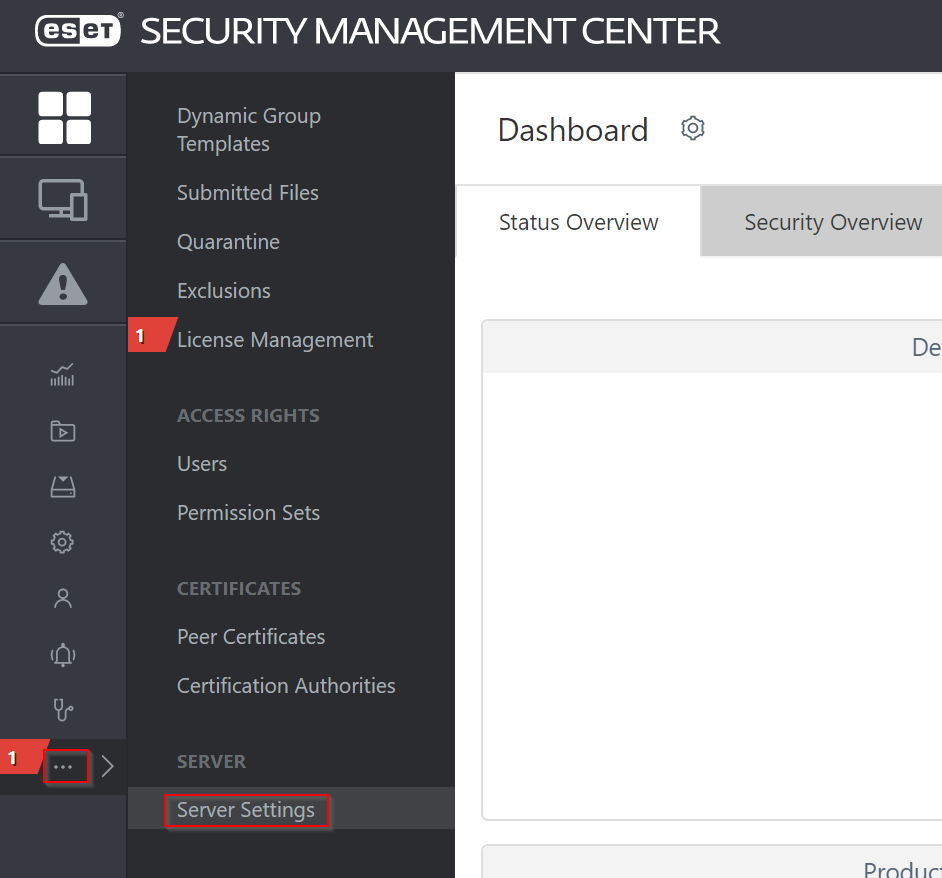
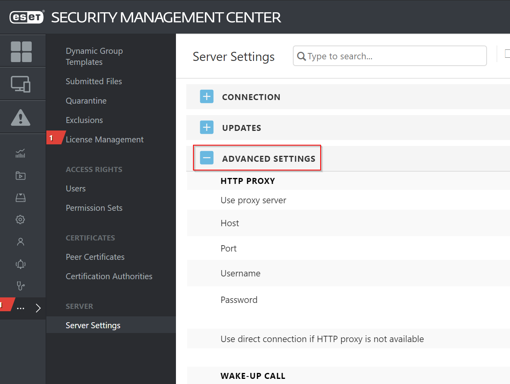
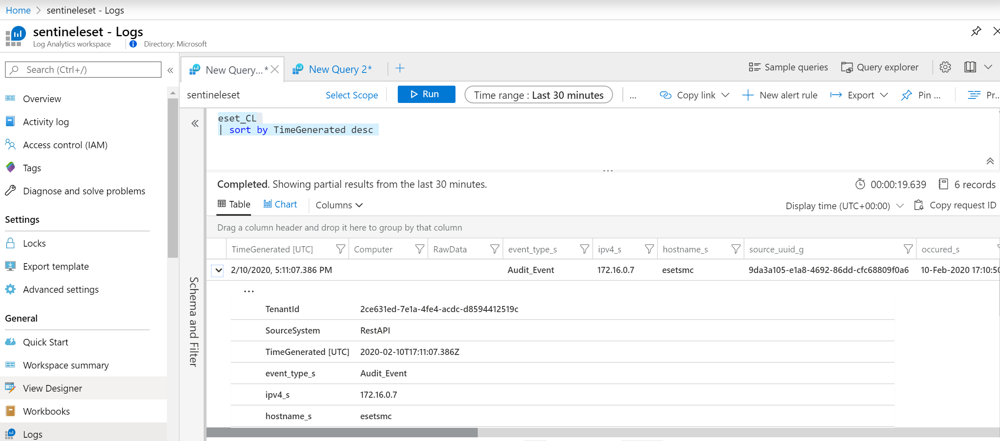

# Integrating ESET SMC to Azure Sentinel
Notes from PoC on Azure Sentinel integration with ESET Security Management Center

**I am in process to push this as community preview connector in Azure-Sentinel GitHub and subsequently Sentinel GUI. At that point this repo will not evolve and further development will be done in official Azure-Sentinel repo.

# Getting ESET logs to Azure Sentinel
We will use Ubuntu 18.04 machine to act as syslog target for ESET and use Log Analytics monitoring agent to push messages to Azure Monitor. To allow for efficient queries we will parse data on agent before sending to Log Analytics and push all data into separate table eset_CL.

## Download and install agent
```bash
# Download onboarding script
wget https://raw.githubusercontent.com/Microsoft/OMS-Agent-for-Linux/master/installer/scripts/onboard_agent.sh 

# Install
chmod +x onboard_agent.sh
./onboard_agent.sh -w [yourworkspaceid] -s [yourkey] -d opinsights.azure.com
```

## Configure rsyslog
Next we need to configure rsyslog to allow remote connections from Eset SMC ip address and also make sure syslog facility user is enabled for Log Analytics agent.

```bash
sudo -i

# Set ESET SMC source IP address
export ESETIP=1.2.3.4

# Create rsyslog configuration file
cat > /etc/rsyslog.d/80-remote.conf << EOF
\$ModLoad imudp
\$UDPServerRun 514
\$ModLoad imtcp
\$InputTCPServerRun 514
\$AllowedSender TCP, 127.0.0.1, $ESETIP
\$AllowedSender UDP, 127.0.0.1, $ESETIP
user.=alert;user.=crit;user.=debug;user.=emerg;user.=err;user.=info;user.=notice;user.=warning  @127.0.0.1:25224
EOF

# Restart rsyslog
systemctl restart rsyslog
```

## Configure Log Analytics agent to send data to separated table
In order to easily recognize Eset data we will push it to separated table. To make it simple we will just modify match oms.** section to send data as API objects by changing type to out_oms_api. Modify file on /etc/opt/microsoft/omsagent/(REPLACEyourworkspaceid)/conf/omsagent.conf. Full match oms.** section looks like this:

```
<match oms.** docker.**>
  type out_oms_api
  log_level info
  num_threads 5
  run_in_background false

  omsadmin_conf_path /etc/opt/microsoft/omsagent/2ce631ed-7e1a-4fe4-acdc-d8594412519c/conf/omsadmin.conf
  cert_path /etc/opt/microsoft/omsagent/2ce631ed-7e1a-4fe4-acdc-d8594412519c/certs/oms.crt
  key_path /etc/opt/microsoft/omsagent/2ce631ed-7e1a-4fe4-acdc-d8594412519c/certs/oms.key

  buffer_chunk_limit 15m
  buffer_type file
  buffer_path /var/opt/microsoft/omsagent/2ce631ed-7e1a-4fe4-acdc-d8594412519c/state/out_oms_common*.buffer

  buffer_queue_limit 10
  buffer_queue_full_action drop_oldest_chunk
  flush_interval 20s
  retry_limit 10
  retry_wait 30s
  max_retry_wait 9m
</match>
```

Next we will modify syslog fluentd parser. Open file /etc/opt/microsoft/omsagent/(REPLACEyourworkspaceid)/conf/omsagent.d/syslog.conf and will do following changes:

* We will tag this source as oms.api.eset. This will lead to creation of eset_CL table for this type of data. Note we do not plan to use this agent server for any other devices so we do not have to use more clever tagging to distinguish different types of data.
* First filter will be used to clean-up message from Eset SMC to be valid JSON, because /r/n characters are being sent and wringly interpretted by syslog server. We will use regex to to find first { and last } character and return this as clean JSON.
* Second filter will simply parse JSON so we have indexed fields in Log Analytics

Full syslog.conf file is here:

```
<source>
  type syslog
  port 25224
  bind 127.0.0.1
  protocol_type udp
  tag oms.api.eset
</source>

<filter oms.api.**>
  @type parser
  key_name message
  format /(?<message>.*?{.*})/
</filter>

<filter oms.api.**>
  @type parser
  key_name message
  format json
</filter>
```

After all changes restart Log Analytics agent and make sure no config changes from portal can be pushed. You can also check logs.

```bash
# Disable changes to configuration files from Portal
sudo su omsagent -c 'python /opt/microsoft/omsconfig/Scripts/OMS_MetaConfigHelper.py --disable'

# Restart agent
sudo /opt/microsoft/omsagent/bin/service_control restart

# Check agent logs
tail -f /var/opt/microsoft/omsagent/log/omsagent.log
```

## Configure ESET SMC to send logs to agent VM in JSON format via Syslog protocol
Configure IP address of Log Analytics agent (syslog server). I got best results when using BSD style. Configure JSON format and log severity of your choice.






## Check logs are gathered in Azure Analytics
You should now see logs being gathered in eset_CL table in Log Analytics. You can use this query:

```
eset_CL
| sort by TimeGenerated desc 
```



# Example workbook
In this section we will create Workbook to visualize data from Eset SMC.

See WorkBooks folder.

# Example hunting query
In this section we will propose few hunting queries to check for interesting data.

See example queries in data connector.

# Example detection rule
In this section we will create detection rule to escalate high severity events from Eset to Sentinel Investigation dashboard and also map entities such as ip, user or url so Investigation map, URL detonation and other features are available for Eset data.

See Detections folder.