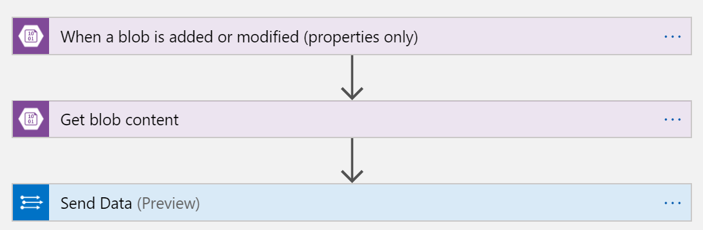
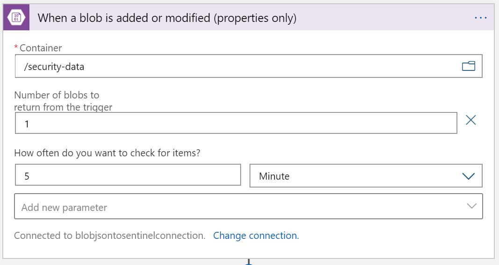
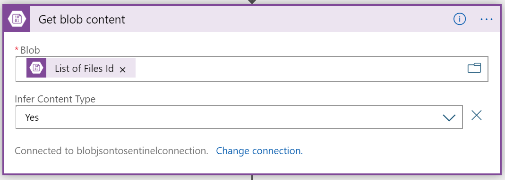
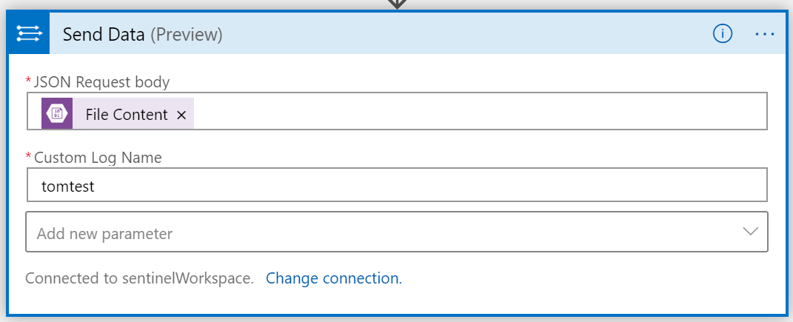

# Sentinel connector for JSON files in Blob storage
This connector is using Logic App to get new JSON files and paste as custom table to Log Analytics workspace.

If file contains more events, connector expects this to be array of objects.

## Logic App

### Step1

### Step 2

### Step 3
